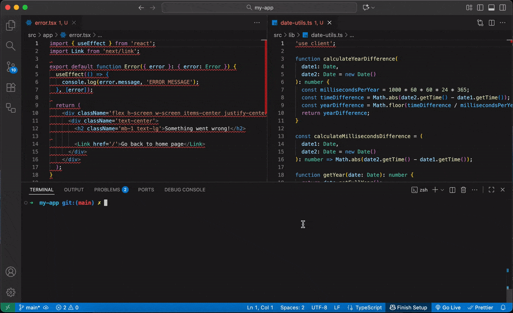

# ESLint Plugin: require "use client" directive

<p align="center">
  
  
</p>

An ESLint plugin that enforces the `"use client"` directive (with a blank line) in Next.js/React client components and removes it from utility/type files. Fully autofixable. Works great with Next.js App Router (Next.js 13+) and React Server Components (RSC).

---

## Table of Contents

- [Why Use This Plugin?](#-why-use-this-plugin)
- [Key Features](#-key-features)
- [Install](#-install)
- [Configuration](#-configuration-example)
- [Usage & Auto-fix](#-usage--auto-fix)
- [Examples](#examples)
- [Before / After (Autofix)](#before--after-autofix)
- [FAQ](#faq)
- [Development](#-development)

<p align="center">
  <a href="https://www.npmjs.com/package/eslint-plugin-require-use-client">
    
  </a>
  <a href="https://www.npmjs.com/package/eslint-plugin-require-use-client">
    
  </a>
  <a href="./LICENSE">
    
  </a>
  <a href="https://github.com/sytnikovzp/eslint-plugin-require-use-client/actions">
    
  </a>
</p>

---

## 🌟 Why Use This Plugin?

- ✅ Consistency: All client components start with an explicit `"use client"` directive.
- ✅ Safety: The directive is removed from type/utility/server-only files where it is not needed.
- ✅ DX: Autofix inserts/removes the directive and ensures a blank line after it.

---

## What the rule does

- If a file uses **client-only features** and is not a Next.js `layout`/`page`, it must start with `"use client";` followed by a blank line.
- If a file is a **type or utility** (e.g. `src/shared/types/**`, `src/common/api/**`, `src/lib/**`), the rule removes `"use client"` if present.
- If `"use client"` exists but there is **no blank line** after it, the rule inserts one.

Client-only features (detected heuristics):

- React hooks like `useEffect`, `useState`, etc.
- DOM/browser APIs: `window`, `document`, `localStorage`, etc.
- Next.js client imports: `next/link`, `next/navigation`, `next/image`, `next/dynamic`.
- JSX with client hooks, event handlers (`onClick`, etc.), `preventDefault`, and `createContext`.
- Next.js App Router client components (Next.js 13+) in RSC context.

Exempt files:

- `layout.*` and `page.*` files in Next.js apps.

---

## ✨ Key Features

- 🧭 Requires `"use client"` when client-only features are used (React hooks, `next/link|navigation|image|dynamic` imports, browser APIs, event handlers, `preventDefault`, `createContext`).
- 🧹 Removes the directive in type/utility files (e.g., `src/shared/types/**`, `src/common/api/**`, `src/lib/**`).
- ↩️ Ensures a blank line immediately after the directive.
- 🛠 Fully compatible with `eslint --fix`.
- 🚀 Works in JS/TS projects, zero dependencies → very fast.

---

## 🔥 Why not just use Prettier?

Prettier handles formatting. This rule is about semantics — ensuring the `"use client"` directive is present (and followed by a blank line) where needed.

---

## 📦 Install

Add the plugin to your project as a dev dependency:

```bash
npm i -D eslint-plugin-require-use-client
```

or with Yarn:

```bash
yarn add -D eslint-plugin-require-use-client
```

---

## ⚙️ Configuration Example

### For `.eslintrc.js` (CommonJS format):

```js
module.exports = {
  plugins: ['require-use-client'],
  rules: {
    'require-use-client/require-use-client-directive': 'warn',
  },
};
```

### For `.eslintrc` or `.eslintrc.json` (JSON format):

```json
{
  "plugins": ["require-use-client"],
  "rules": {
    "require-use-client/require-use-client-directive": "warn"
  }
}
```

### For `.eslint.config.js` (ES module format):

```js
import requireUseClient from 'eslint-plugin-require-use-client';

export default {
  plugins: {
    'require-use-client': requireUseClient,
  },
  rules: {
    'require-use-client/require-use-client-directive': 'warn',
  },
};
```

---

## 🛠 Usage & Auto-fix

You can automatically apply the rule across your project:

```bash
npx eslint --fix .
```

This will enforce the correct presence/absence of the `"use client"` directive across your project.

---

## Examples

- **Enforce for event handlers**

  - Source: `export default () => <button onClick={() => {}}/>`
  - Fix: inserts `'use client';` + blank line

- **Remove from utility/type files**

  - Source: `'use client';\n\nexport const T = 1;`
  - Fix: removes directive (preserves existing blank line)

- **Require for Next.js imports**
  - Source: `import Link from 'next/link'; export default () => <Link href="/"/>`
  - Fix: inserts `'use client';` + blank line

---

## Before / After (Autofix)

Insert directive when needed:

```tsx
// Before
import React, { useEffect } from 'react';
export default function C() {
  useEffect(() => {});
  return <div />;
}

// After (eslint --fix)
'use client';

import React, { useEffect } from 'react';
export default function C() {
  useEffect(() => {});
  return <div />;
}
```

Remove directive in utility/type files:

```ts
// Before (utility/type)
'use client';

export type T = { a: number };

// After (eslint --fix)
export type T = { a: number };
```

Ensure blank line after directive:

```tsx
// Before
'use client';
import React from 'react';

// After (eslint --fix)
'use client';

import React from 'react';
```

---

## FAQ

- **Is this compatible with Prettier?**  
  Yes. Prettier handles formatting; this rule enforces the `"use client"` directive.

- **How do I enforce `"use client"` in Next.js App Router?**  
  Enable the rule `require-use-client/require-use-client-directive` in your ESLint config and run `eslint --fix`. The rule detects client-only features (hooks, Next.js client imports, event handlers, browser APIs) and inserts the directive with a blank line.

- **Does this rule work with React Server Components (RSC)?**  
  Yes. It helps keep client components explicitly marked while avoiding `"use client"` in server/utility files.

- **What counts as client-only features?**  
  React hooks (e.g., `useEffect`), `next/link|navigation|image|dynamic` imports, access to `window`/`document`/`localStorage`, JSX event handlers (e.g., `onClick`), calls to `preventDefault`, `createContext`.

- **In which files should the directive be absent?**  
  Type/utility files (e.g., `src/shared/types/**`, `src/common/api/**`, `src/lib/**`), and Next.js `layout.*`/`page.*` are exempt.

- **Supported versions?**  
  Node.js 18+, ESLint 8+. Tested with React 18 and Next.js.

Useful links:

- ESLint Rules and Autofix: https://eslint.org/docs/latest/extend/custom-rules
- Next.js Client Components and `"use client"`: https://nextjs.org/docs/app/building-your-application/rendering/client-components

## 📢 Perfect for Teams & Open Source Projects

Ensures a **consistent guideline** for client components in your Next.js/React projects.
Great for **large codebases** where explicitly separating client and server code matters.

---

## 🛠 Development

This plugin is built with TypeScript for better type safety and maintainability.

### Prerequisites

- Node.js >= 18
- npm or yarn

### Setup

```bash
# Install dependencies
npm install

# Build the project
npm run build

# Run tests
npm test

# Watch mode for development
npm run dev
```

### Project Structure

```
index.js                      # Main plugin entry
lib/
  rules/
    require-use-client-directive.js   # Rule implementation
tests/
  require-use-client-directive.test.js
```

## 📜 License

This project is licensed under the MIT License - see the [LICENSE](./LICENSE) file for details.
